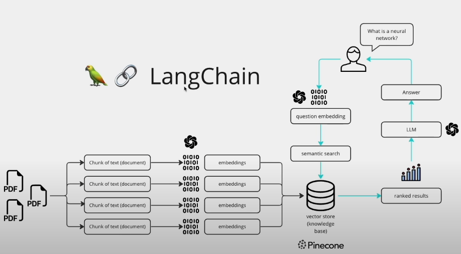

# 📚 Multi-PDF Chat 

Welcome to the **Multi-PDF Chat** — an intelligent chatbot that understands and interacts with multiple PDFs using LangChain, Google Gemini AI, FAISS vector database, and a beautifully crafted Streamlit interface. Ask questions and get accurate, real-time answers from your uploaded documents!

---

## 📝 Project Overview

This application allows users to upload one or more PDF files, automatically extracts and indexes the content, and enables smart Q\&A with the help of vector search and generative AI.

---

## 🧠 How It Works



1. **PDF Upload**: Users upload multiple PDFs via the app interface.
2. **Text Extraction**: Text is extracted from the PDFs using `PyPDF2`.
3. **Text Chunking**: Extracted text is split into manageable chunks using LangChain's `RecursiveCharacterTextSplitter`.
4. **Embedding Generation**: Chunks are converted into embeddings using `GoogleGenerativeAIEmbeddings`.
5. **Vector Storage**: Embeddings are stored in a local FAISS index.
6. **Similarity Search**: User questions are compared to the indexed content.
7. **Answer Generation**: Relevant chunks are passed to Gemini AI, which responds with accurate and context-aware answers.

---

## 🔥 Key Features

* ✅ **Multiple PDF Support**
* ✅ **Semantic Search with FAISS**
* ✅ **Conversational Answering via Gemini AI**
* ✅ **Beautiful, Responsive UI with Streamlit**
* ✅ **Custom Sidebar with Profile & Upload Section**

---

## 💻 Tech Stack

| Technology                      | Purpose                                    |
| ------------------------------- | ------------------------------------------ |
| `LangChain`                     | Text splitting, embeddings, chain handling |
| `FAISS`                         | Vector search and retrieval                |
| `Google Generative AI (Gemini)` | LLM response generation                    |
| `Streamlit`                     | Web-based interface for interaction        |
| `PyPDF2`                        | Extracting text from PDFs                  |
| `dotenv`                        | Environment configuration                  |

---

## 📦 Requirements

Install the following Python packages:

```bash
pip install -r requirements.txt
```

Packages include:

* streamlit
* google-generativeai
* langchain
* faiss-cpu
* PyPDF2
* python-dotenv
* langchain\_google\_genai

---

## ⚙️ Setup Instructions

1. **Clone the repository**

```bash
git clone https://github.com/Danish7861/Multi-PDF-Chat.git
cd Multi-PDF-Chat
```

2. **Create a `.env` file**

```env
GOOGLE_API_KEY=<your-google-api-key>
```

> Get your API key from: [https://makersuite.google.com/app/apikey](https://makersuite.google.com/app/apikey)

3. **Run the Streamlit App**

```bash
streamlit run app.py
```

---

## 📁 Project Structure

```
Multi-PDF-Chat/
│
├── app.py                     # Main Streamlit app
├── .env                      # Environment variables
├── requirements.txt          # All dependencies
├── assets/
│   └── img/                  # UI Images
├── backend/
│   ├── pdf_processor.py      
│   ├── vector_store.py
│   ├── conversational_chain.py      
│   └── qa_handler.py        
└── README.md
```

---

## 🙌 Credits

Made with ❤️ by [**Danish Shahzad**](https://github.com/Danish7861)

---

## 📢 Connect With Me

* 🔗 [LinkedIn](https://www.linkedin.com/in/danishshahzad17)
* 📽️ [YouTube Channel](https://www.youtube.com/@DanishShahzadAI)

---
